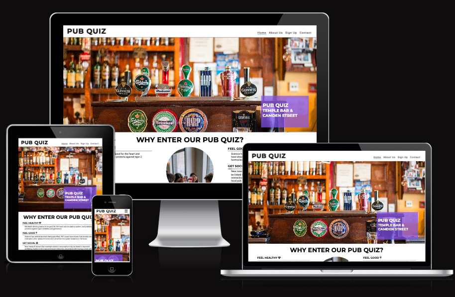

# Pub Quiz

The Pub Quiz website is a landing page for pub quiz enthusiasts designed to offer a hub where they can find schedules for upcoming quizzes, join competitions, and access a wide range of trivia questions to sharpen their skills. 

Users will be able to find out information about event times, pricing, contact information and there will be sign up form to participate.

# Features

### - Navigation
        - At the top of the page, the navigation shows the name pub quiz in the left corner. This is linked to the top of the page.
        - The other navigation links are located on the right side: About us, Sign up, Contact which link to different sections of the same page.
        - The navigation will help the user understand where key information about the event lies.

### - Header
        - The header shows the words "Pub Quiz" and it explains it is for adults only.
        - Details why you should enter, benefits etc.
        - As you scroll down, it shows the days of the week, times and location of each quiz.
        

### - The About Us Section

        - Details what the site is and who the target audience is.

### - The Sign Up Form
        - The sign up section has a form to collect users details so they can enter the pub quiz.
        - The form collects the users first and last name and email address

### - The Contact Section
        - The contact section encourages users to get in contact with any queries, providing a phone number, email address and street address.

### - Testing
        - I tested this page works in different browsers: Chrome, Firefox, Safari.
        - I confirmed this project is responsive, looks well and functions on all standard screen sizes usgin the devtools devices toolbar.
        - I checked that the navigation, header, about us, sign up, and contact text are all readable and easy to understand
        - I have confirmed that the form works

### - Bugs
    - Solved bugs
      - When the sign up form was completed, the final row had details of the love running project, I had to remove the "road" value and preference-road id and replace it with n/a so I         would not confuse the user. I could not leave the value empty as the html validator informed me.
      - Lots of other bugs mentioned in the commit file on github

### - Validator Testing
    - HTML - no errors returned when passing through the official validator

    - CSS - no errors found when passing through the jigsaw validator

    - Accessibility score was 100

### - Unfixed Bugs
no unfixed bugs

### - Deployment
    - The site was deployed to GitHub pages.
    - Deployment
    - The site was deployed to GitHub pages. The steps to deploy are as follows:
    - In the GitHub repository, navigate to the Settings tab
    - From the source section drop-down menu, select the Master Branch
    - Once the master branch has been selected, the page provided the link to the completed website
    https://niall-5p.github.io/Project-1-HTML-CSS/

### - Credits
    - Love Running project
    - Chat gpt to troubleshoot some errors
    

### - Content
    - The code to make the social media links was taken from the love running project, as was the sign up form and general skeleton of the site.
    - Most CSS styling was taken from love running project also.

### - Media
    - Images taken from [pexels](https://www.pexels.com/)

